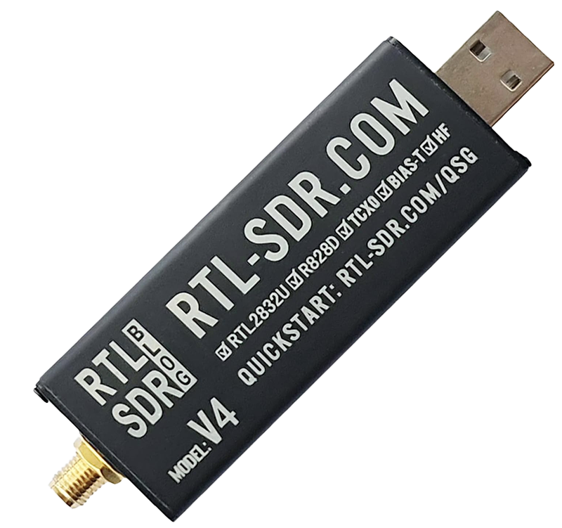

<!-- prettier-ignore-start -->
[comment]: # (
SPDX-License-Identifier: MIT
)

[comment]: # (
SPDX-FileCopyrightText: 2024 Carles Fernandez-Prades <cfernandez@cttc.es>
)
<!-- prettier-ignore-end -->

gnsssdr-telecorenta
-------------------

This image contains GNSS-SDR with the drivers supporting the RTL-SDR v4 dongle.



## Setup for Microsoft Windows

You must be running Windows 10 version 2004 and higher (Build 19041 and higher) or Windows 11 to use the commands below.

1. Install Windows Subsystem for Linux (WSL): Open PowerShell or Windows Command Prompt in administrator mode by right-clicking and selecting "Run as administrator", enter the `wsl --install` command, then restart your machine.
    ```
    wsl --install
    ```

2. Install Docker Desktop from https://docs.docker.com/desktop/install/windows-install/ and configure it to use WSL (it's the default option).

3. Install the USBIPD-WIN project by donwloading the `.msi` file from https://github.com/dorssel/usbipd-win/releases and executing it.

4. Plug your RTL-SDR v4 USB dongle.

5. List all of the USB devices connected to Windows by opening PowerShell in administrator mode and entering the following command:

    ```
    usbipd list
    ```

    Take note of the Bus and Device of your dongle (appears as `Realtek Semiconductor Corp. RTL2838 DVB-T`).

6. Before attaching the USB device, the command `usbipd bind` must be used to share the device, allowing it to be attached to WSL. This requires administrator privileges. Select the bus ID of the device you would like to use in WSL and run the following command:

    ```
    usbipd bind --busid 3-4
    ```

Change `3-4` by the actual Bus and Device ID from the previous step.

7. To attach the USB device, run the following command. (You no longer need to use an elevated administrator prompt):

    ```
    usbipd attach --wsl --busid <busid>
    ```

    Here, `<busid>` will be the same that you specified in the previous step.

8. Now, from the WSL command line, run `lsusb` to list the attached USB devices:

    ```
    Bus 004 Device 001: ID 1d6b:0003 Linux Foundation 3.0 root hub
    Bus 003 Device 004: ID 0b05:193b ASUSTek Computer, Inc. ITE Device(8295)
    Bus 003 Device 003: ID 3277:0018 Sonix Technology Co., Ltd. USB2.0 FHD UVC WebCam
    Bus 003 Device 002: ID 0b05:19b6 ASUSTek Computer, Inc. N-KEY Device
    Bus 003 Device 004: ID 0bda:2838 Realtek Semiconductor Corp. RTL2838 DVB-T
    ```

The dongle is identified as `Realtek Semiconductor Corp. RTL2838 DVB-T`. Take note of the bus number and the device ID. For instance, if your dongle appears at `Bus 003 Device 004: ...` then your device can be found at `/dev/bus/usb/003/004`.

## Setup for GNU/Linux

The commands below have been tested in Ubuntu distributions, but should be similar in other distributions.

1. Install Docker. Check https://docs.docker.com/desktop/install/linux/ for instructions.

2. Use `lsusb` to get the address of your device:

    ```
    Bus 002 Device 002: ID 8087:8002 Intel Corp. 
    Bus 002 Device 001: ID 1d6b:0002 Linux Foundation 2.0 root hub
    Bus 001 Device 002: ID 8087:800a Intel Corp. 
    Bus 001 Device 001: ID 1d6b:0002 Linux Foundation 2.0 root hub
    Bus 003 Device 004: ID 0bda:2838 Realtek Semiconductor Corp. RTL2838 DVB-T
    Bus 003 Device 001: ID 1d6b:0002 Linux Foundation 2.0 root hub
    ```

The dongle is identified as `Realtek Semiconductor Corp. RTL2838 DVB-T`. Take note of the bus number and the device ID. For instance, if your dongle appears at `Bus 003 Device 004: ...` then your device can be found at `/dev/bus/usb/003/004`.

## Download and use the Docker image

Download the Docker image. From your terminal:

```
docker pull carlesfernandez/gnsssdr-telecorenta:latest
```

Check that you can run it:
```
docker run -it --rm carlesfernandez/gnsssdr-telecorenta gnss-sdr --version
```

You should get something similar to:
```
gnss-sdr version 0.0.19.git-next-ff11347a0
```

Connect your USB dongle.

Now you are ready to use the image. Go to your favorite working folder, copy your configuration file there (for instance, `rtl.conf`) and run the following command:

```
docker run -it --rm -v $PWD:/home \
  --device=/dev/bus/usb/xxx/yyy:/dev/bus/usb/xxx/yyy \
  carlesfernandez/gnsssdr-telecorenta \
  gnss-sdr --c=./rtl.conf
```

where `xxx` and `yyy` are the bus number and the device ID of the previous steps. The GNSS receiver should start working.

## Example of configuration file

```
[GNSS-SDR]

;######### GLOBAL OPTIONS ##################
GNSS-SDR.internal_fs_sps=2000000

;######### SIGNAL_SOURCE CONFIG ############
SignalSource.implementation=Osmosdr_Signal_Source
SignalSource.item_type=gr_complex
SignalSource.sampling_frequency=2000000
SignalSource.freq=1575420000
SignalSource.gain=60
SignalSource.rf_gain=60
SignalSource.if_gain=60
;SignalSource.AGC_enabled=true
SignalSource.osmosdr_args=rtl,bias=1

;######### SIGNAL_CONDITIONER CONFIG ############
SignalConditioner.implementation=Pass_Through

;######### CHANNELS GLOBAL CONFIG ############
Channels_1C.count=8
Channels.in_acquisition=1

;######### ACQUISITION GLOBAL CONFIG ############
Acquisition_1C.implementation=GPS_L1_CA_PCPS_Acquisition
Acquisition_1C.item_type=gr_complex
;Acquisition_1C.pfa=0.1
Acquisition_1C.threshold=2.4
Acquisition_1C.doppler_max=5000
Acquisition_1C.doppler_step=250
Acquisition_1C.dump=false
Acquisition_1C.dump_filename=acq_dump
Acquisition_1C.dump_channel=0
;Acquisition_1C.coherent_integration_time_ms=2
Acquisition_1C.max_dwells=1

;######### TRACKING GLOBAL CONFIG ############
Tracking_1C.implementation=GPS_L1_CA_DLL_PLL_Tracking
Tracking_1C.item_type=gr_complex
Tracking_1C.pll_bw_hz=40.0
Tracking_1C.dll_bw_hz=5.0;
Tracking_1C.dump=false
Tracking_1C.dump_filename=./trk_dump

;######### TELEMETRY DECODER GPS CONFIG ############
TelemetryDecoder_1C.implementation=GPS_L1_CA_Telemetry_Decoder

;######### OBSERVABLES CONFIG ############
Observables.implementation=Hybrid_Observables

;######### PVT CONFIG ############
PVT.implementation=RTKLIB_PVT
PVT.positioning_mode=Single
PVT.output_rate_ms=100
PVT.display_rate_ms=500
PVT.iono_model=Broadcast
PVT.trop_model=Saastamoinen
```
